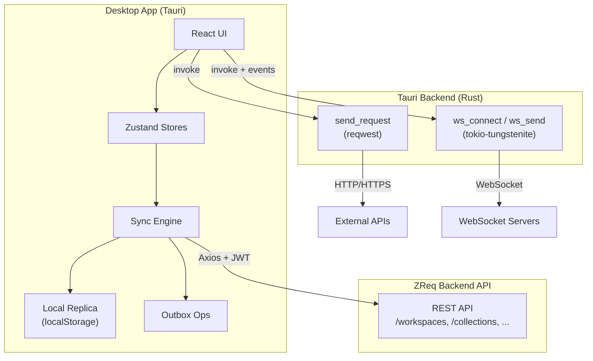

# Arsitektur ZReq

## Diagram tingkat tinggi



---

## Struktur folder

```
zreq/
├── src/                      # Frontend React
│   ├── App.tsx               # Root: auth gate, sync bootstrap, layout
│   ├── components/
│   │   ├── auth/             # Login, register, OAuth, onboarding
│   │   ├── collection/       # Tree, import, settings
│   │   ├── environment/      # Selector, manager dialog
│   │   ├── layout/           # TopBar, Sidebar, tabs, window controls
│   │   ├── request/          # Request builder (HTTP + WS)
│   │   ├── response/         # Response & WS message panels
│   │   ├── settings/         # App settings, MCP OAuth
│   │   ├── sync/             # Conflict dialog, status strip
│   │   └── ui/               # shadcn-style primitives
│   ├── hooks/                # useRequest, useWebSocket, useCollection, ...
│   ├── lib/
│   │   ├── local-replica/    # Sync engine, outbox, snapshot store
│   │   ├── persist-request.ts # buildPersistPayload, inferProtocolFromUrl
│   │   ├── api-client.ts     # Axios ke backend ZReq
│   │   ├── env-resolver.ts   # Resolve {{variables}}
│   │   ├── importExport.ts   # Postman/ZReq import
│   │   └── ...
│   ├── store/                # Zustand stores
│   ├── types/                # TypeScript domain types
│   ├── locales/              # en.json, id.json
│   └── i18n/
├── src-tauri/                # Rust Tauri shell
│   └── src/
│       ├── lib.rs            # Plugin init, invoke handlers
│       └── commands/
│           ├── http.rs       # send_request
│           └── ws.rs         # WebSocket session management
├── docs/                     # Dokumentasi (folder ini)
└── public/
```

---

## State management (Zustand)

| Store | File | Tanggung jawab |
|-------|------|----------------|
| `useAppStore` | `store/index.ts` | Request tabs, collections, environments, workspaces, active selection, console |
| `useAuthStore` | `store/authStore.ts` | JWT token, user session |
| `useInstanceStore` | `store/instanceStore.ts` | Daftar backend instance, active base URL |
| `useSyncStore` | `store/syncStore.ts` | Sync state, conflicts, online status, outbox count |

`useAppStore` adalah store terbesar — mengelola UI state request builder dan mirror data dari local replica.

---

## Local replica & sync

### Konsep

1. **Replica snapshot** — salinan lokal workspaces, collections, environments per `(userId, instanceBaseUrl)` disimpan di localStorage
2. **Outbox** — antrian operasi write (create/patch/delete) yang belum ter-push ke server
3. **Entity meta** — tracking `serverUpdatedAt`, `dirty`, `baseServerUpdatedAt` untuk optimistic locking

### Alur edit lokal

```
User edit collection/env
    → local-write.ts update snapshot + enqueue outbox op
    → (debounced) sync-engine push outbox ke API
    → on conflict: ConflictDialog
    → on success: update meta, clear dirty
```

### File kunci sync

| File | Fungsi |
|------|--------|
| `sync-engine.ts` | pull, push, pullThenPush, conflict detection |
| `snapshot-store.ts` | Persist/load replica ke localStorage |
| `outbox-ops.ts` | CRUD outbox queue |
| `local-write.ts` | Entry point untuk edit lokal |
| `conflict-resolve.ts` | Resolusi konflik user choice |
| `types.ts` | `ReplicaSnapshot`, `OutboxOp`, `ConflictEntry` |

### Tipe operasi outbox

- `collection_create` / `collection_patch` / `collection_delete`
- `workspace_create` / `workspace_patch` / `workspace_delete`
- `environment_create` / `environment_patch` / `environment_delete`

---

## Tauri commands (Rust)

Frontend memanggil Rust via `@tauri-apps/api/core` `invoke()`:

| Command | Modul | Deskripsi |
|---------|-------|-----------|
| `send_request` | `http.rs` | Kirim HTTP request (reqwest). Support JSON, form-data, urlencoded, raw |
| `ws_connect` | `ws.rs` | Buka koneksi WebSocket, emit events handshake/message/status |
| `ws_send` | `ws.rs` | Kirim text/binary frame |
| `ws_send_ping` | `ws.rs` | Kirim ping frame |
| `ws_disconnect` | `ws.rs` | Tutup session |

WebSocket menggunakan **Tauri events** (`ws-handshake`, `ws-message`, `ws-status`) untuk stream real-time ke React hook `useWebSocket`.

### Persistensi request (HTTP & WS)

`src/lib/persist-request.ts` — helper bersama untuk save/autosave:

| Fungsi | Deskripsi |
|--------|-----------|
| `buildPersistPayload` | Bangun payload save dari `ActiveRequest`; sertakan field WS hanya jika `protocol === 'ws'` |
| `inferProtocolFromUrl` | Infer `'ws'` dari URL `ws://` / `wss://` bila `protocol` tidak ada (legacy data) |

Digunakan oleh `RequestBuilder`, `useAutosave`, dan `loadRequestItem` (via fallback saat hydrate dari koleksi).

### Tauri plugins

- `deep-link` — OAuth callback `zreq://`
- `dialog` — file picker (binary WS payload)
- `fs` — baca file untuk binary upload
- `opener` — buka URL eksternal
- `single-instance` — satu instance app + deep link forwarding

---

## Domain types (TypeScript)

Definisi utama di `src/types/index.ts`:

- `RequestItem`, `Folder`, `Collection` — struktur tree koleksi
- `Environment`, `EnvVariable` — environment variables
- `ActiveRequest`, `RequestTab` — state request builder per tab
- `HttpResponse` — hasil HTTP dari Rust
- `WsFrame`, `WsConnectionState`, `WsSavedMessage` — WebSocket
- `AuthConfig` — none | inherit | bearer | basic | jwt

---

## Environment variable resolution

`env-resolver.ts` mengganti `{{key}}` di URL, headers, body sebelum request dikirim.

Variable diambil dari:
1. Active environment (workspace-scoped)
2. Collection/folder variables (inheritance chain)
3. Pre-request script via `pm.environment.set()`

---

## Autentikasi & API client

```
Axios apiClient
  → interceptor: set baseURL dari active instance
  → interceptor: attach Bearer token
  → on 401: logout
```

OAuth GitHub flow:
1. User klik login GitHub → redirect ke backend OAuth
2. Backend redirect ke `zreq://callback?...`
3. Deep link handler (`oauth-callback.ts`) exchange code → set auth

---

## Persistensi lokal (localStorage keys)

| Key | Data |
|-----|------|
| `zreq_token`, `zreq_user` | Session auth |
| `zreq_instances` | Backend instances |
| `zreq_environment_by_workspace` | Active env per workspace |
| `zreq_sync_push_strategy` | Sync strategy preference |
| `zreq_locale` | Bahasa UI |
| `zreq_sidebar_layout` | Panel layout |
| Replica snapshot | Via `snapshot-store` (key = replicaKey) |

---

## i18n

- Bahasa: `en`, `id`
- File: `src/locales/en.json`, `src/locales/id.json`
- Config: `src/i18n/config.ts`
- Switch locale: Settings atau `setAppLocale()`
